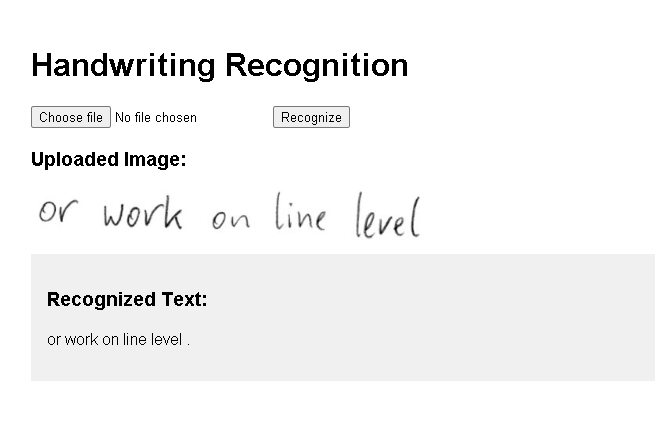

# ✍️ Handwriting Recognition Web App

A simple yet powerful web application that performs **handwriting recognition** using **Microsoft’s TrOCR model** and displays the recognized text from uploaded handwritten image files.

Built with **Flask** (Python web framework) and **Transformers** (by Hugging Face).

---

## 🚀 Features

- Upload `.jpg`, `.jpeg`, `.png` handwritten image files
- Recognizes handwritten text using **TrOCR (Transformer OCR)**
- Displays extracted text in a clean web interface
- Works offline after initial model download

---

## 🧰 Tech Stack

| Layer        | Tech                         |
|--------------|------------------------------|
| Backend      | Python, Flask                |
| AI Model     | `microsoft/trocr-base-handwritten` (Hugging Face) |
| Frontend     | HTML, CSS (basic)            |
| Image Processing | Pillow (PIL)             |

---

## 📦 Installation

### 1. Clone the Repository

```bash
git clone [https://github.com/yourusername/handwriting-recognizer.git](https://github.com/sujit-codezen/Handwriting-Recognition-Web-App.git)
cd handwriting-recognizer
```

### 2. Create a Virtual Environment

```bash
python -m venv venv
source venv/bin/activate  # on Windows: venv\Scripts\activate
```

### 3. Install Requirements
```bash
pip install -r requirements.txt
```


### 4. Run the App
```bash
python app.py
```

### 5. Output

